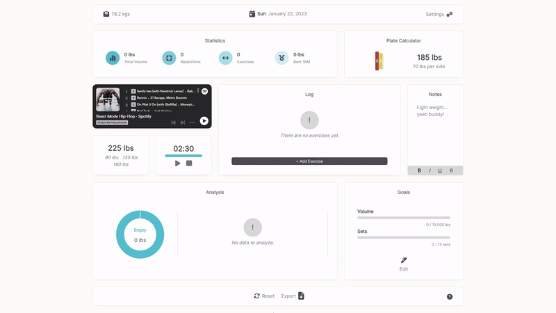

 

    
    <h1>Widgets 4 Workouts</h1>
    <h3>Training Helper</h3>

 

## 📒 Installation
To run locally:

1. Install dependencies with `npm install`
2. Start server with `npm run dev`

Online version: [Click](https://edu-flores.github.io/projects/w4w/dist/index.html)

 

## 📷 Overview

Several helpful widgets that aid your daily workouts. These widgets adapt to any screen and provide you very useful information about the way you train.

 

## 🦾 Features

* Statistics (Total Volume, Repetitions, Exercises and 1RM)
* Barbell Plate Calculator
* Spotify integration
* Warmup & Dropset Calculator
* Timer
* Exercise log
* Notes
* Volume analyisis
* Goals
* Daily workout export

 

## 💻 Usage

Log your sets and reps into the Log widget. This will update your statistics, analysis and goals widgets.

To calculate how many plates you need to reach a specific weight on an olympic barbell (45 lbs), use the plate calculator widget.

Similarly, to calculate the 40%, 60% and 80% of a specific weight for warmup and/or dropset puroposes use the other calculator widget.

To track your rest between sets, you can tweak the given timer (max of 59 mins and 59 seconds) to your liking.

 

## ✍️ Design

Initial Figma design: [Click](https://www.figma.com/file/UEas8z3y1EDz8s8EHoEV4c/Widgets-4-Workouts?node-id=0%3A1&t=aMvxPbF7AH3Oa9JJ-1)

